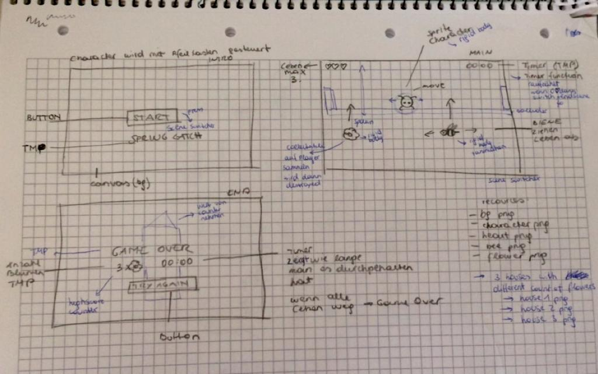

# MiniGame1-aschnee

**Spring Catch**
In this Game the User plays a little bug, which has to collect flowers in order to build his own home. The User has to help him collect
those flowers. While trying to collect as many flowers as possible he has to avoid the bees because those can kill the bug. 
The little bug has three lifes and the Game ends when he has lost all three.

+ **Progress:** 100%
+ **Status:** 
	- concept finished
	- necessary game functions work
	- flower house replaced by different count of flowers in the end scene
 
+ **Trailer:
	- https://youtu.be/kErXYmcN68c
+ **PLAY THE GAME HERE:** 
	- 
+ **Development Platform:** 
	Unity 2018.2.14f1, 
	Visual Studio 15.9.4, 
	WIN, 
	Scripting Runtime Version .NET 3.5 Equivalent, 
	API Compatibility Level: .NET 2.0 Subset
+ **Target Platform:** 
	WebGL (Resolution: 1024*768)

 
+ **Controles:** 
	- arrow key left, arrow key right, mouse click (in menu)
	
+ **Resources:** 
**
	- teaching materials by smers		
	- background elements: https://www.freepik.com/free-vector/fairy-tale-forest-background_3327511.htm 	

 
+ **Third party material:**
 //	

+ **Concept:
**

	
+ **In game Screenshots:**

+ **Limitations:
** 
	- This Game is very simple
	
 
+ **Lessons Learned:
**   
	- How to switch between scenes
	- Timer
	- Using Scriptable Objects
	

Copyright by Alina Schneeberger, 2019
